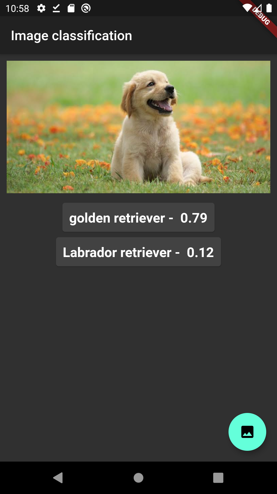

# ImageClassification using tflite and flutter

A new Flutter application for on device Image Classification using tensorflow-lite . 

### Installing

1. Download Android Studio/VisualStudioCode with Flutter sdk.  (refer: https://flutter.dev/docs). 
2. Clone this repo.
3. Run main.dart.

## Built With

* [Flutter](https://flutter.dev/) - The framework used
* [Tensorflow](https://www.tensorflow.org/) - image classification model 

## Getting Started
A few resources to get you started if this is your first Flutter project:

- [Lab: Write your first Flutter app](https://flutter.dev/docs/get-started/codelab)
- [Cookbook: Useful Flutter samples](https://flutter.dev/docs/cookbook)

